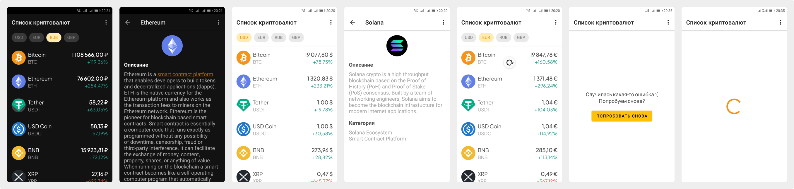

# CryptoPrice

CryptoPrice — Android-приложение, позволяющее просматривать информацию о криптовалютах. Приложение получает данные при помощи [CoinGecko API](https://www.coingecko.com/ru/api/documentation).

- [Видео-демонстрация работы приложения](https://youtu.be/ntPU0rzGoG8)
- [Скачать собранный .apk](https://drive.google.com/file/d/1nbU9NUL-mj1QV1XU0MAiewGMhLm1ISSr/view)

## Функционал

- Получение списка криптовалют с текущей ценой в выбранной валюте и процентом изменения цены за последние 24 часа
- При выборе криптовалюты отображается экран с дополнительной информацией (описание, категории)
- Выбор валюты
- Обновление данных в списке криптовалют при помощи Pull to Refresh (потяните вниз для обновления)
- Анимация отображения списка (RecyclerView), анимация экрана просмотра информации о криптовалюте
- Векторные изображения популярных криптовалют (для всех остальных изображения берутся из API)
- Отображение экрана с ошибкой при получении неверных данных от API, при отсутствии интернет-соединения
- При загрузке данных отображается круглый прогресс бар
- Поддержка тёмной темы
- Поддержка мультиязычности (русский, английский)
- Отображение символа валюты (до или после числа) зависит от региональных настроек телефона

Обратите внимание, что API имеет лимит в 50 запросов в минтуту. При исчерпании всех вызовов приложение будет отображать экран с ошибкой.

## Стек

- Kotlin
- XML
- Single Activity
- Retrofit
- Gson
- Glide (image loading and caching library)

## Использованные ресурсы

Шрифт "Plus Jakarta Sans" ([Open Font License](http://scripts.sil.org/OFL), [GitHub](https://github.com/tokotype/PlusJakartaSans), [Google Fonts](https://fonts.google.com/specimen/Plus+Jakarta+Sans)).

## План разработки

Примерный план с оценкой времени.

Создание экрана "Список криптовалют" (менее 2 часов):

1. Подключение к API
2. Верстка xml-разметки
3. Создание RecyclerView, Adapter, ViewModel, модели для криптомонеты
4. Обработка нажатия на элемент списка

Создание экрана "Отображение информации о криптомонете" (~1 час):

5. Верстка xml-разметки
6. Получение данных и вывод в вьюшки

Финальные шаги (~1 час):

7. Добавление мелких фичей
8. Исправление ошибок
9. Полировка приложения
